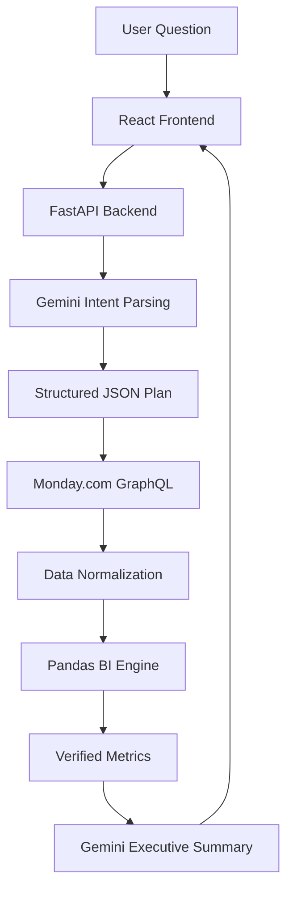

<div align="center">
  <h1>🦅 Skylark BI Agent</h1>
  <p><strong>A deterministic, real-time AI Business Intelligence agent over live Monday.com operational data.</strong></p>

  <p>
    <a href="https://frontend-3o06y1dnq-subhash45.vercel.app"></a>
  </p>

  <p>
    
    
    
    
    
    
  </p>
</div>

<hr />

## 🌟 Overview
Executive teams require immediate, cross-functional visibility into live operational metrics (Sales Deals and Engineering Work Orders). Traditional BI dashboards are static, and raw LLMs frequently hallucinate financial arithmetic.

**The Skylark BI Agent** bridges this gap by offering a natural language conversational interface that guarantees **100% deterministic mathematical accuracy**. It uses Google Gemini strictly for semantic intent parsing and executive interpretation, while relying entirely on Python and Pandas to execute authoritative calculations against live Monday.com GraphQL data.

---

## 🏗️ Architecture & Core Systems



### 🔹 Deterministic BI Engine
**Gemini is blocked from doing math.** All aggregations, counts, groupings, and date-range filtering are deterministically calculated via `pandas` in Python. This ensures **0% hallucination** on financial metrics.

### 🔹 Dynamic Column Discovery
Rather than hardcoding fragile column IDs, the agent fetches board metadata to dynamically map normalized text titles (e.g., `"probable start date"`) to their live Monday.com internal hashes.

### 🔹 Robust Normalization & Date Parsing
Monday.com returns highly variable data types (strings, JSON, empty arrays) and non-standard timezone notations (e.g., `(Coordinated Universal Time)`). A strict normalization engine converts financial figures and strips breaking timezone strings to allow flawless timestamp casting.

### 🔹 Data Quality Transparency
Missing data is not silently ignored. If deals lack financial values, the agent flags this (e.g., *"Pipeline totals exclude 184 deals with missing values"*), maintaining absolute trust in the generated reports.

### 🔹 Cross-Board Analytics
Queries like *"Give me a leadership update"* automatically span multiple boards, pulling and analyzing live data from both the **Deals** pipeline and **Work Orders** execution tracking.

---

## 🚀 Live Demo
You can test the application live directly at the Vercel URL below:

👉 **[Live Frontend Application](https://frontend-3o06y1dnq-subhash45.vercel.app)**

### Example Questions to Try:
- *"How many deals do we have?"*
- *"What is our open pipeline value?"*
- *"Which work orders are starting soon?"*
- *"Give me a leadership update."*

---

## ⚙️ Local Setup & Execution

### 1️⃣ Environment Variables
Create a `.env` file in the `backend/` directory with the following keys:
```env
MONDAY_API_TOKEN=your_monday_token
MONDAY_DEALS_BOARD_ID=5030975323
MONDAY_WORK_ORDERS_BOARD_ID=5030975433
GEMINI_API_KEY=your_gemini_key
FRONTEND_URL=http://localhost:5173
```

### 2️⃣ Backend (FastAPI)
```bash
cd backend
python -m venv venv
source venv/bin/activate  # or venv\Scripts\activate on Windows
pip install -r requirements.txt
uvicorn app.main:app --reload
```

### 3️⃣ Frontend (React)
```bash
cd frontend
npm install
npm run dev
```

---

## 🚢 Deployment Details
The application is fully containerized and deployed across two platforms:

- **Backend (Render)**: 
  - **Root**: `backend`
  - **Build**: `pip install -r requirements.txt`
  - **Start**: `uvicorn app.main:app --host 0.0.0.0 --port 10000`
- **Frontend (Vercel)**:
  - **Framework**: Vite (`npm run build`)
  - **Variables**: `VITE_API_URL` securely links to the Render instance.

---

## 📄 License
This project is licensed under the MIT License - see the [LICENSE](LICENSE) file for details.
