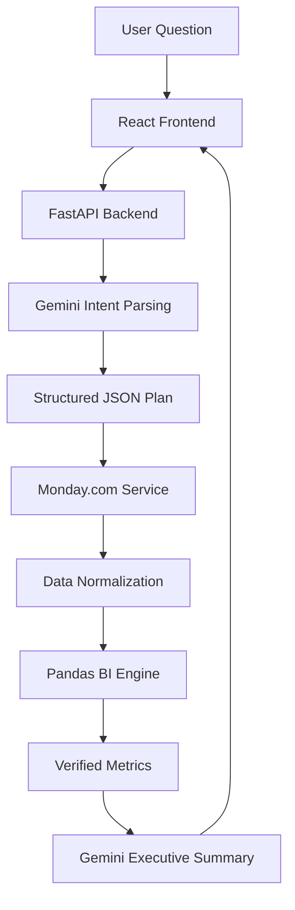

# Skylark BI Agent

## Problem Statement
Executive teams require immediate, cross-functional visibility into live operational metrics (Sales Deals and Engineering Work Orders). Traditional BI dashboards are static and slow, while raw LLMs frequently hallucinate financial arithmetic and metrics.

## Solution
The Skylark BI Agent bridges this gap by offering a natural language conversational interface that guarantees 100% deterministic mathematical accuracy. It uses Gemini strictly for semantic intent parsing and executive interpretation, while relying entirely on Python and Pandas to execute authoritative calculations against live Monday.com GraphQL data.

## Architecture


## Tech Stack
- **Frontend**: React, Vite, Tailwind CSS v4, React Markdown
- **Backend**: Python 3.10+, FastAPI, Pandas, python-dotenv
- **External APIs**: Monday.com GraphQL API, Google Gemini API

## Core Systems

### Monday.com Integration
Connects directly to the live Monday.com GraphQL API to fetch the latest state of Deals and Work Orders in real time.

### Dynamic Column Discovery
Rather than hardcoding column IDs, the agent dynamically fetches board metadata mapping column titles (like `probable start date`) to their internal IDs. This allows Monday.com administrators to rename columns without breaking the application.

### GraphQL Pagination
Ensures 100% data integrity by following GraphQL cursors (`next_items_page`) until all records are retrieved, guaranteeing no deals or work orders are silently truncated.

### Caching
A 5-minute in-memory TTL cache (`cachetools`) minimizes latency and prevents excessive rate-limiting on both the Monday.com API and Gemini API during conversational bursts.

### Normalization
Monday.com returns highly variable data types (e.g., strings, JSON, empty arrays). The Normalization Service strictly converts financial figures, percentages, statuses, and dates into uniform Pandas types.

### Date Parsing
Monday.com injects trailing timezone text into dates (e.g., `(Coordinated Universal Time)`). The normalization engine robustly strips this text to allow accurate Pandas `pd.to_datetime` parsing, avoiding `NaT` failures.

### Deterministic BI Engine
**Business metrics are deterministically calculated from the live Monday.com data.** 
Gemini is blocked from doing math. Pandas handles all aggregations, counting, and date-range filtering, ensuring 0% hallucination on financial metrics.

### Gemini's Role
Gemini acts solely as an orchestrator and interpreter:
1. Translates natural language into a JSON `StructuredQueryPlan`.
2. Reads the Pandas-calculated output and formats it into a professional executive summary.

### Data-Quality Handling
The agent proactively reports missing data (e.g., "184 deals missing values") rather than crashing or inventing numbers, maintaining high executive trust.

### Cross-Board Analysis
Queries like "Give me a leadership update" automatically pull, join, and analyze both the Deals board and Work Orders board simultaneously.

## Setup & Local Execution

### Environment Variables
Create a `.env` file in the `backend/` directory:
```env
MONDAY_API_TOKEN=your_monday_token
MONDAY_DEALS_BOARD_ID=5030975323
MONDAY_WORK_ORDERS_BOARD_ID=5030975433
GEMINI_API_KEY=your_gemini_key
FRONTEND_URL=http://localhost:5173
```

### Backend
```bash
cd backend
python -m venv venv
source venv/bin/activate  # or venv\Scripts\activate on Windows
pip install -r requirements.txt
uvicorn app.main:app --reload
```

### Frontend
```bash
cd frontend
npm install
npm run dev
```

## Deployment

### Render (Backend)
- **Root Directory**: `backend`
- **Build Command**: `pip install -r requirements.txt`
- **Start Command**: `uvicorn app.main:app --host 0.0.0.0 --port 10000`
- **Required Env Vars**: `MONDAY_API_TOKEN`, `MONDAY_DEALS_BOARD_ID`, `MONDAY_WORK_ORDERS_BOARD_ID`, `GEMINI_API_KEY`, `FRONTEND_URL` (Set to Vercel URL)

### Vercel (Frontend)
- **Root Directory**: `frontend`
- **Framework**: Vite
- **Build Command**: `npm run build`
- **Output Directory**: `dist`
- **Required Env Vars**: `VITE_API_URL` (Set to Render backend URL)

## Example Questions
- "How many deals do we have?"
- "What is our open pipeline value?"
- "Which work orders are starting soon?"
- "Give me a leadership update."

## Assumptions & Limitations
- **Limitations**: The agent does not persist conversational history across page reloads (stateless memory).
- **Assumptions**: Assumes Monday.com board structures retain their core column titles, even if internal IDs change.

## Security
- Strict `.gitignore` prevents `.env` leaks.
- CORS policy restricts backend access to the defined `FRONTEND_URL`.
- Secrets are NEVER sent to the browser or logged in stdout.

## AI Tools Used
This project was developed with the assistance of advanced AI coding agents.

## Future Improvements
- Migration from the deprecated `google.generativeai` SDK to the new `google.genai` package.
- Implementation of Redis for persistent conversational memory.
