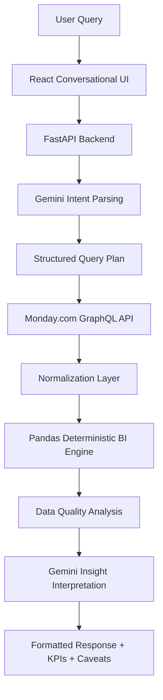

# Skylark Drones — Monday.com Business Intelligence Agent

A conversational Business Intelligence (BI) agent that dynamically queries Monday.com Deals and Work Orders boards, normalizes unstructured business data, calculates deterministic BI metrics, and uses Gemini to generate actionable insights. This project was developed as a comprehensive technical implementation for the Skylark Drones assignment.

## Live Demo

Frontend:
[https://frontend-ten-sepia-evh69p154q.vercel.app](https://frontend-ten-sepia-evh69p154q.vercel.app)

Backend Health:
[https://skylark-bi-agent-uis3.onrender.com/health](https://skylark-bi-agent-uis3.onrender.com/health)

GitHub:
[https://github.com/subhashchandra1224/skylark-bi-agent](https://github.com/subhashchandra1224/skylark-bi-agent)

## Problem Statement

Business analysts and project managers need quick, accurate answers from operational data distributed across diverse platforms like Deals and Work Orders boards. Traditional dashboards are static, and extracting cross-board insights manually is slow.

Key challenges include:
- Inconsistent data formatting and data entry
- Missing fields and missing financial values
- Different date formats across boards
- Difficulties in cross-board reasoning and operational analysis
- The inability to ask natural-language questions and get immediate, deterministic answers.

## Architecture



## Tech Stack

**Frontend:**
- React
- Vite
- Tailwind CSS

**Backend:**
- Python
- FastAPI
- Pandas

**AI:**
- Google Gemini

**Integration:**
- Monday.com GraphQL API

**Deployment:**
- Render
- Vercel

## Key Features

- Conversational BI interface for natural language querying
- Live Monday.com data integration
- Dynamic column discovery via GraphQL
- Strict GraphQL pagination to ensure data completeness
- 5-minute TTL caching for high performance and rate-limit safety
- Deterministic Pandas calculations for reliable and reproducible deterministic business metrics calculated from live Monday.com data.
- Gemini natural-language understanding and response generation
- Robust data normalization
- Transparent data-quality warnings and caveats
- Semantic date filtering (e.g., "this quarter", "soon")
- Cross-board analytics
- Leadership updates spanning entire operations
- Visual KPI cards and responsive UI
- Graceful API and LLM error handling

## Important Design Decision

**Gemini is NOT trusted to calculate authoritative business metrics.**

Business metrics are deterministically calculated from live Monday.com data using Pandas. The LLM is used strictly for natural-language interpretation (converting the question into a JSON query plan) and narrative generation (converting the calculated KPIs into a readable summary).

Python/Pandas calculates counts, pipeline totals, status distributions, date filtering, and operational metrics.

## Monday.com Integration

The agent integrates with Monday.com via the GraphQL API with strict read-only behavior. 

It features dynamic column discovery, meaning it fetches board metadata to map normalized column titles to internal Monday IDs dynamically. Pagination is strictly enforced at runtime fetching to ensure all records are retrieved, and a 5-minute cache minimizes API load.

**The application does not hardcode the supplied assignment dataset. Monday.com is the runtime source of truth.**

## Data Resilience

The Normalization Layer is built to handle messy real-world data gracefully, including:
- Null fields and empty strings
- Inconsistent text and statuses
- Unparseable numeric/currency values (defaulting to zero rather than crashing)
- Genuinely missing values

**Date Normalization:**
Monday may return date values containing timezone text such as a trailing parenthesized timezone description (e.g., `(Coordinated Universal Time)`). The normalization layer standardizes these values, stripping the invalid strings before Pandas date conversion, preventing systemic `NaT` failures.

## Data Quality & Assumptions

Incomplete records are not fabricated. The system makes the following assumptions and quality enforcements:
- The GraphQL metadata perfectly reflects the current board schema (dynamic discovery).
- Missing financial values are treated as zero for applicable aggregate calculations, while the number of missing values is surfaced as a data-quality caveat.
- Ambiguous date strings are stripped of their parenthetical timezone anomalies to default to UTC before Pandas calculation.
- It is assumed that unrelated deals and work orders should not be arbitrarily joined without a semantic relationship.

## Cross-Board Analytics

Deals and Work Orders can be analyzed together where a defensible relationship exists (e.g., generating high-level company overviews). Ambiguous relationships are not fabricated, and questions requiring arbitrary joins between unrelated deals and work orders are flagged or gracefully limited to high-level summarization.

## Leadership Update

The Leadership Update feature provides a comprehensive summary across all integrated boards. It summarizes relevant pipeline health, sales status, operational execution, risks, upcoming activity, and highlights critical data-quality caveats using both boards simultaneously.

## Example User Queries

- How many deals do we have?
- How many deals are open?
- What is our open pipeline value?
- How are our deals distributed by stage?
- Which deals are expected to close soon?
- How are our work orders performing?
- How many work orders are ongoing?
- Which work orders are starting soon?
- Which projects are expected to end soon?
- What operational issues need attention?
- How is our pipeline looking this quarter?
- Give me a leadership update.

*Note: Queries regarding "soon" or "upcoming" dates are deterministically bounded to a window of today through the next 90 days.*

## Local Setup

### Backend

```bash
cd backend

# Create virtual environment
python -m venv .venv

# Activate (Windows)
.venv\Scripts\activate

# Activate (macOS/Linux)
source .venv/bin/activate

# Install dependencies
pip install -r requirements.txt

# Copy environment variables
cp .env.example .env
```

Fill the required private environment variables in `.env`.

Start the backend:
```bash
uvicorn app.main:app --reload
```
The backend will be available at `http://localhost:8000`.

### Frontend

```bash
cd frontend

# Install dependencies
npm install

# Copy environment variables
cp .env.example .env
```

Configure `VITE_API_URL` to point to your local or remote backend.

Start the frontend:
```bash
npm run dev
```

## Environment Variables

### Backend
- `MONDAY_API_TOKEN`: Your private Monday.com API access token.
- `MONDAY_DEALS_BOARD_ID`: The ID of the Deals board in Monday.com.
- `MONDAY_WORK_ORDERS_BOARD_ID`: The ID of the Work Orders board in Monday.com.
- `GEMINI_API_KEY`: Your Google Gemini API key.
- `FRONTEND_URL`: The URL of the deployed frontend (used for CORS configuration).

### Frontend
- `VITE_API_URL`: The URL of the FastAPI backend.

## Deployment

**Render backend:**
- **Root Directory**: `backend`
- **Build**: `pip install -r requirements.txt`
- **Start**: `uvicorn app.main:app --host 0.0.0.0 --port 10000`
- **Environment variables**: `MONDAY_API_TOKEN`, `MONDAY_DEALS_BOARD_ID`, `MONDAY_WORK_ORDERS_BOARD_ID`, `GEMINI_API_KEY`, `FRONTEND_URL`

**Vercel frontend:**
- **Root Directory**: `frontend`
- **Framework**: `Vite`
- **Build**: `npm run build`
- **Output**: `dist`
- **Environment variable**: `VITE_API_URL=https://skylark-bi-agent-uis3.onrender.com`

## Challenges Faced

During development, several critical engineering challenges were encountered:
1. **Mathematical Hallucinations**: Initial iterations allowed the LLM to aggregate pipeline values, leading to wildly inconsistent arithmetic (e.g., hallucinated millions). This was solved by restricting Gemini to semantic intent routing and strictly using Pandas for deterministic math.
2. **GraphQL Schema Volatility**: Monday.com columns use abstract IDs (`numbers5`, `date4`) rather than readable titles. This was solved by implementing a dynamic GraphQL discovery query at runtime to map readable titles to internal IDs.
3. **Dirty Date Formats**: Monday API date fields returned unparseable strings containing literal text like `(Coordinated Universal Time)`. A robust Python normalization layer using regex/stripping was built to sanitize these into valid `pd.Timestamp` objects.

## Trade-offs

1. **Direct API vs. MCP**: A direct GraphQL API integration was chosen over a heavier Model Context Protocol (MCP) abstraction. This traded the theoretical flexibility of MCP for tight optimization, strict pagination control, and deterministic error handling.
2. **Stateless vs. Stateful**: The agent is currently stateless. We traded persistent conversational memory (which requires Redis/Postgres) for a vastly simpler, faster, and cheaper deployment footprint.

## Potential Improvements

1. **Session Memory**: Implementing Redis-based session storage to support persistent multi-turn conversational memory.
2. **SDK Migration**: The project currently uses `google.generativeai` which produces a deprecation warning; migration to the new `google.genai` SDK is a future maintenance improvement.
3. **Automated Monday Webhooks**: Transitioning from a pull-based caching model (5-minute TTL) to a push-based webhook model where Monday.com pushes updates to invalidate the cache instantly.


## AI Tools Used

AI tools were used for development assistance, debugging, architecture refinement, and documentation formatting during the creation of this project. AI is not used to replace deterministic business calculations at runtime.
